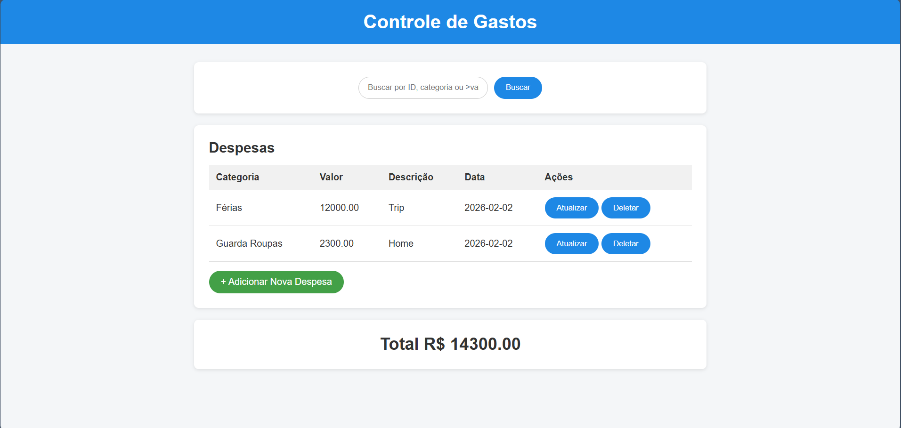

  

<h1 align="center">💰 Expense Controll</h1>

  
  <b>Sistema completo para gerenciamento de despesas pessoais</b> 
  Backend (Java Spring Boot) • PostgreSQL (Neon) • Frontend (HTML/CSS/JS)  

  
  
  
  

  
  
  

  

  👉 <a href="https://expensecontroll.netlify.app/">Acessar o Frontend</a>  
  •  
  👉 <a href="https://expense-control-project.onrender.com/expenses">API Online</a>

📘 Expense Control Project
Um sistema completo para gerenciamento de despesas, composto por um backend em 
Spring Boot e um frontend em HTML/CSS/JS, permitindo cadastrar, listar, atualizar,
buscar e excluir despesas de forma simples e eficiente.

🚀 Tecnologias Utilizadas

🖥️ Frontend
HTML5
CSS3
JavaScript (Vanilla)
Consumo de API via fetch()

🛠️ Backend
Spring Boot
Spring Data JPA
Maven
Java 17
H2 Database

🎯 Objetivo do Projeto
O objetivo é oferecer um sistema simples e intuitivo para controle de gastos pessoais.
O usuário pode:

* Visualizar despesas
* Adicionar novas despesas
* Atualizar informações
* Deletar despesas
* Buscar por:
   *ID
   *Categoria
   *Valor maior que X

🖼️ Preview da Aplicação

Tela inicial do sistema:

📂 Estrutura do Projeto
Expense-Control-Project/
│
├── backend/
│   ├── src/
│   ├── pom.xml
│   ├── mvnw / mvnw.cmd
│   └── ... (todos os arquivos do backend)
│
├── frontend/
│   ├── index.html
│   ├── insert.html
│   ├── style.css
│   └── script.js
│
└── README.md

🔗 Integração Front-End + Back-End

O frontend se comunica com a API através da constante:
const API_URL = "http://localhost:8080/expenses";

E utiliza fetch() para:
Buscar despesas
Atualizar valores
Enviar novos registros
Deletar dados

🧠 Principais Funcionalidades
🔍 Busca Inteligente

O campo de busca aceita:

Busca	                             Exemplo                        	Resultado
---
ID	                                 2	                            Busca despesa com ID 2
Categoria  	                      category/3	                      Lista despesas da categoria 3
Valor maior que	                    >500	                          Lista despesas maiores que 500

📥 Cadastro de Despesas

A página insert.html permite:
Criar nova despesa
Atualizar uma despesa existente (quando aberta com ?id=X)

📊 Tabela de Despesas
Mostra:
Categoria
Valor
Descrição
Data
Botões de Ação: Atualizar e Deletar

💰 Totalizador Automático
O valor total das despesas é atualizado automaticamente a cada alteração.

📌 Status do Projeto

✔ Backend finalizado
✔ Frontend estruturado
✔ Integração concluída
🔄 Melhorias futuras podem ser adicionadas

🧑‍💻 Autor
Abimael Abreu
Desenvolvedor Java | Spring Boot | Web Development
