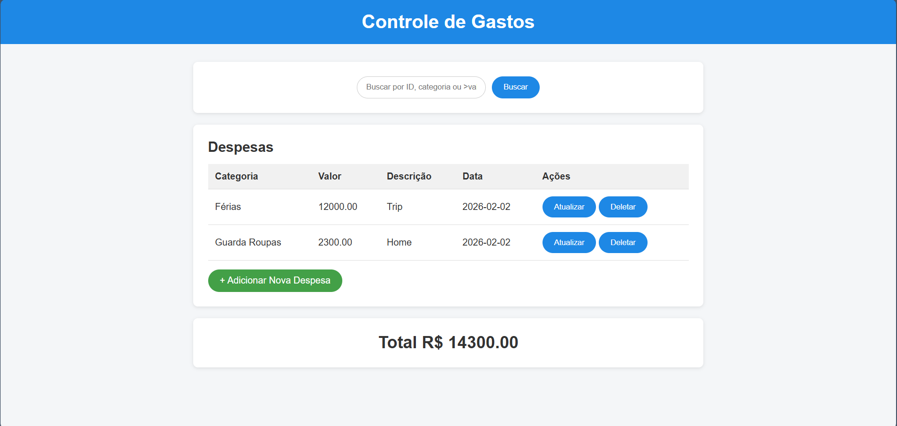

# 💰 Expense Control API

<p align="center">
Sistema completo de gerenciamento de despesas desenvolvido com foco em backend moderno utilizando Java e Spring Boot.
</p>

<p align="center">
API REST com autenticação, arquitetura em camadas e deploy em nuvem.
</p>

---

## 🌐 Live Demo

<p align="center">
👉 <a href="https://expensecontroll.netlify.app/">Acessar o Frontend</a>  
👉 <a href="https://expense-control-project.onrender.com/expenses">API Online</a>
</p>

---

## 📘 Sobre o Projeto

O **Expense Control** é uma aplicação web completa para gerenciamento de despesas pessoais, composta por um backend robusto em Spring Boot e um frontend integrado consumindo API REST.

O sistema permite operações completas de CRUD, buscas dinâmicas e cálculo automático de despesas, com deploy em ambiente de produção.

---

## 🏗️ Arquitetura

O projeto foi desenvolvido seguindo boas práticas de arquitetura em camadas:

- **Controller** → Responsável pelos endpoints da API  
- **Service** → Regras de negócio  
- **Repository** → Acesso ao banco de dados  

Utilizando o padrão MVC adaptado para APIs REST.

---

## 🔐 Segurança

A aplicação utiliza autenticação baseada em **JWT (JSON Web Token)**, garantindo:

- Autenticação de usuários  
- Controle de acesso por permissões  
- Proteção de endpoints  

### Fluxo de autenticação:

1. Usuário realiza login  
2. Recebe um token JWT  
3. Token é enviado nas requisições autenticadas  

---

## 🛠️ Tecnologias Utilizadas

### ⚙️ Backend
- Java 21  
- Spring Boot 3  
- Spring Security  
- JWT  
- Spring Data JPA / Hibernate  
- Maven  

### 🖥️ Frontend
- HTML5  
- CSS3  
- JavaScript (Vanilla)  
- Consumo de API com fetch()  

### 🗄️ Banco de Dados
- PostgreSQL (Neon)

### ☁️ Deploy
- Backend: Render  
- Frontend: Netlify  

---

## 🎯 Funcionalidades

✔ Cadastro de despesas  
✔ Listagem de despesas  
✔ Atualização de dados  
✔ Exclusão de despesas  
✔ Busca por ID, categoria e valor  
✔ Totalizador automático de despesas  
✔ Integração completa com API REST  

---

## 🔍 Busca Inteligente

O campo de busca aceita múltiplos padrões:

| Tipo de Busca | Exemplo     | Resultado                          |
|--------------|------------|-----------------------------------|
| ID           | 2          | Retorna despesa de ID 2           |
| Categoria    | category/3 | Lista despesas da categoria 3     |
| Valor maior  | >500       | Lista despesas maiores que 500    |

---

## 🖼️ Preview da Aplicação

<p align="center">

</p>

> Adicione mais imagens para demonstrar o fluxo completo do sistema

---

## 📂 Estrutura do Projeto

📂 Estrutura do Projeto
Expense-Control-Project/
│
├── backend/
│   ├── src/
│   ├── pom.xml
│   ├── mvnw / mvnw.cmd
│   └── ...
│
├── frontend/
│   ├── index.html
│   ├── insert.html
│   ├── style.css
│   └── script.js
│
└── README.md

🔗 Integração Frontend + Backend

O frontend se comunica com a API por meio de:

const API_URL = "https://expense-control-project.onrender.com/expenses";


### Operações disponíveis:

- GET → buscar despesas  
- POST → criar nova despesa  
- PUT → atualizar registro  
- DELETE → excluir despesa  

---

## 🚀 Como Executar o Projeto

```bash
# Clonar o repositório
git clone https://github.com/Abimael-bak/Expense-Control-Project

# Acessar o diretório
cd Expense-Control-Project

# Executar o backend
./mvnw spring-boot:run

📌 Status do Projeto
Item	Status
Backend	✔ Concluído
Banco de Dados	✔ Hospedado e integrado
Frontend	✔ Publicado
Deploy	✔ Online
Melhorias Futuras	🔄 Aceitando evoluções
👨‍💻 Autor

Abimael Abreu
Desenvolvedor Java | Spring Boot | Frontend Web
